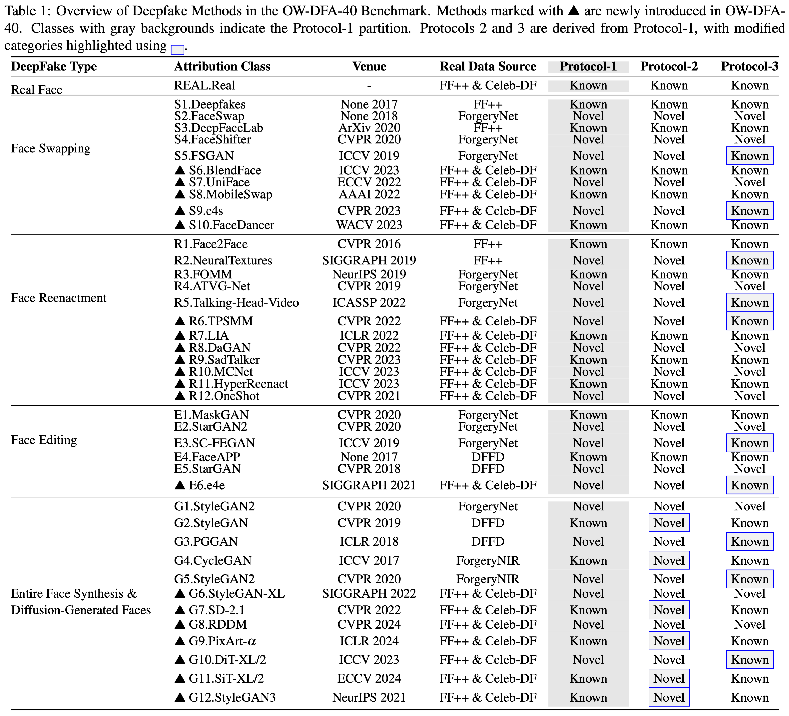
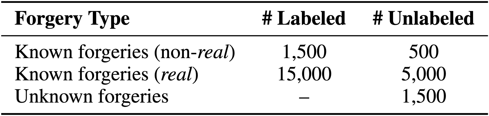

# Open-World Deepfake Attribution via Confidence-Aware Asymmetric Learning

<p align="center">
    
    &nbsp;
    <a href="https://arxiv.org/pdf/2512.12667"></a>
    &nbsp;
    <a href="https://huggingface.co/datasets/hyzheng/OWDFA40-Benchmark"></a>
</p>
<p align="center">
	Open-World Deepfake Attribution via Confidence-Aware Asymmetric Learning<br>
</p>


The proliferation of synthetic facial imagery has intensified the need for robust Open-World DeepFake Attribution (OW-DFA), which aims to attribute both known and unknown forgeries using labeled data for known types and unlabeled data containing a mixture of known and novel types. However, existing OW-DFA methods face two critical limitations: 1) A confidence skew that leads to unreliable pseudo-labels for novel forgeries, resulting in biased training. 2) An unrealistic assumption that the number of unknown forgery types is known *a priori*. To address these challenges, we propose a Confidence-Aware Asymmetric Learning (CAL) framework, which adaptively balances model confidence across known and novel forgery types. CAL mainly consists of two components: Confidence-Aware Consistency Regularization (CCR) and Asymmetric Confidence Reinforcement (ACR). CCR mitigates pseudo-label bias by dynamically scaling sample losses based on normalized confidence, gradually shifting the training focus from high- to low-confidence samples. ACR complements this by separately calibrating confidence for known and novel classes through selective learning on high-confidence samples, guided by their confidence gap. Together, CCR and ACR form a mutually reinforcing loop that significantly improves the model's OW-DFA performance. Moreover, we introduce a Dynamic Prototype Pruning (DPP) strategy that automatically estimates the number of novel forgery types in a coarse-to-fine manner, removing the need for unrealistic prior assumptions and enhancing the scalability of our methods to real-world OW-DFA scenarios. Extensive experiments on the standard OW-DFA benchmark and a newly extended benchmark incorporating advanced manipulations demonstrate that CAL consistently outperforms previous methods, achieving new state-of-the-art performance on both known and novel forgery attribution.

## Quick Start

### 1. Dependencies

We recommend using Conda:

```bash
conda env create -f environment.yml
conda activate owdfa
```

### 2. Dataset

#### OWDFA-40 Dataset Description



Our **OWDFA-40** dataset extends CPL-ICCV2023 by incorporating a doubled number of recent face manipulation methods.  

1. All real-face images from different sources are treated as a single *real* class.
2. The data sampling strategy and the labeled/unlabeled split are summarized in the table below.
3. Specifically, samples are first uniformly collected, after which 20% of the data from each category is held out to construct the test set. (see the details in dataset/owdfa_dataset.py)



The dataset is publicly available at:

https://huggingface.co/datasets/hyzheng/OWDFA40-Benchmark

#### Download

```bash
python dataset/get_data.py --dataset_root /your_path/OWDFA40-Benchmark
```

#### Unzip

```bash
cd /your_path/OWDFA40-Benchmark/data
for z in *.zip; do
    echo "Extracting $z ..."
    unzip -q "$z" -d "${z%.zip}"
done
```

#### Configuration

Set dataset paths and machine-specific settings in your config file:

```python
dataset_root = "/your_path/OWDFA40-Benchmark/data"
predictor_path = "/your_path/OWDFA40-Benchmark/shape_predictor_68_face_landmarks.dat"
```

---

## Training

### Scripts

Train with default protocol (fixed-K setting):

```bash
bash scripts/train.sh
```

Train with prototype pruning (without K):

```bash
bash scripts/train_wok.sh
```

---

## Results

### Known-K Setting

Different random seeds in dataset construction may introduce performance variations; thus, we recommend fixing the random seed for dataset construction. We provide two sets of results below for reference.

| Protocol | Paper (3 runs) | This Repo (3 runs) |
|----------|---------------|--------------------|
| P1       | All ACC 88.3 <br />Known ACC 98.0 <br />New ACC 76.5 | seed 2025: All ACC 87.98 / Known ACC 98.04 / New ACC 75.47 [checkpoint](https://huggingface.co/hyzheng/OWDFA_CAL/resolve/main/protocol1/protocol1_seed2025.ckpt)<br />seed 2026: All ACC 88.53 / Known ACC 98.24 / New ACC 76.59 [checkpoint](https://huggingface.co/hyzheng/OWDFA_CAL/resolve/main/protocol1/protocol1_seed2026.ckpt)<br />seed 2027: All ACC 88.37 / Known ACC 98.11 / New ACC 76.39 [checkpoint](https://huggingface.co/hyzheng/OWDFA_CAL/resolve/main/protocol1/protocol1_seed2027.ckpt)<br />Average: All ACC: 88.29 / Known ACC: 98.13 / New ACC: 76.15 |
| P2       | All ACC 82.8<br />Known ACC 97.6<br />New ACC 67.5 | seed 2025: All ACC 82.42 / Known ACC 97.95 / New ACC 66.14 [checkpoint](https://huggingface.co/hyzheng/OWDFA_CAL/resolve/main/protocol2/protocol2_seed2025.ckpt)<br />seed 2026: All ACC 81.83 / Known ACC 97.88 / New ACC 65.04 [checkpoint](https://huggingface.co/hyzheng/OWDFA_CAL/resolve/main/protocol2/protocol2_seed2026.ckpt)<br />seed 2027: All ACC 81.38 / Known ACC 97.69 / New ACC 64.40 [checkpoint](https://huggingface.co/hyzheng/OWDFA_CAL/resolve/main/protocol2/protocol2_seed2027.ckpt)<br />Average: All ACC: 81.88 / Known ACC: 97.84 / New ACC: 65.19 |
| P3       | All ACC 91.0<br />Known ACC 94.8<br />New ACC 80.3 | seed 2025: All ACC 90.74 / Known ACC 95.29 / New ACC 83.36 [checkpoint](https://huggingface.co/hyzheng/OWDFA_CAL/resolve/main/protocol3/protocol_seed2025.ckpt)<br />seed 2026: All ACC 90.62 / Known ACC 95.32 / New ACC 79.61 [checkpoint](https://huggingface.co/hyzheng/OWDFA_CAL/resolve/main/protocol3/protocol_seed2026.ckpt)<br />seed 2027: All ACC 90.96 / Known ACC 95.30 / New ACC 78.08 [checkpoint](https://huggingface.co/hyzheng/OWDFA_CAL/resolve/main/protocol3/protocol_seed2027.ckpt)<br />Average: All ACC: 90.77 / Known ACC: 95.30 / New ACC: 80.35 |

### Unknown-K Setting

| Protocol | Paper (3 runs) | This Repo (3 runs) |
|----------|---------------|--------------------|
| P1       | All ACC 87.5<br />Known ACC 98.2<br />New ACC 76.5 | seed 2025: All ACC 88.66 / Known ACC 98.39 / New ACC 77.21 [checkpoint](https://huggingface.co/hyzheng/OWDFA_CAL/resolve/main/wok_protocol1/wok_protocol1_seed2025.ckpt)<br />seed 2026: All ACC 88.63 / Known ACC 97.93 / New ACC 77.73 [checkpoint](https://huggingface.co/hyzheng/OWDFA_CAL/resolve/main/wok_protocol1/wok_protocol1_seed2026.ckpt)<br />seed 2027: All ACC 87.62 / Known ACC 98.12 / New ACC 74.62 [checkpoint](https://huggingface.co/hyzheng/OWDFA_CAL/resolve/main/wok_protocol1/wok_protocol1_seed2027.ckpt)<br />Average: All ACC 88.30 / Known ACC 98.15 / New ACC 76.52 |
| P2       | All ACC 80.0<br />Known ACC 97.5<br />New ACC 63.0 | seed 2025: All ACC 81.76 / Known ACC 97.90 / New ACC 65.74 [checkpoint](https://huggingface.co/hyzheng/OWDFA_CAL/resolve/main/wok_protocol2/wok_protocol2_seed2025.ckpt)<br />seed 2026: All ACC 81.32 / Known ACC 97.60 / New ACC 64.73 [checkpoint](https://huggingface.co/hyzheng/OWDFA_CAL/resolve/main/wok_protocol2/wok_protocol2_seed2026.ckpt)<br />seed 2027: All ACC 83.11 / Known ACC 97.59 / New ACC 68.31 [checkpoint](https://huggingface.co/hyzheng/OWDFA_CAL/resolve/main/wok_protocol2/wok_protocol2_seed2027.ckpt)<br />Average: All ACC 82.06 / Known ACC 97.70 / New ACC 66.26 |
| P3       | All ACC 91.5<br />Known ACC 95.0<br />New ACC 83.2 | seed 2025: All ACC 91.22 / Known ACC 95.28 / New ACC 77.56 [checkpoint](https://huggingface.co/hyzheng/OWDFA_CAL/resolve/main/wok_protocol3/wok_protocol3_seed2025.ckpt)<br />seed 2026: All ACC 90.96 / Known ACC 95.51 / New ACC 79.06 [checkpoint](https://huggingface.co/hyzheng/OWDFA_CAL/resolve/main/wok_protocol3/wok_protocol3_seed2026.ckpt)<br />seed 2027: All ACC 92.10 / Known ACC 95.41 / New ACC 83.92 [checkpoint](https://huggingface.co/hyzheng/OWDFA_CAL/resolve/main/wok_protocol3/wok_protocol3_seed2027.ckpt)<br />Average: All ACC 91.43 / Known ACC 95.40 / New ACC 80.18 |

---

## Citation

If you find this repository useful, please consider citing our work:

```bibtex

```

---

## Acknowledgements

This project is built upon the following excellent works:

- [CPL-ICCV23](https://github.com/TencentYoutuResearch/OpenWorld-DeepFakeAttribution)
- [CDAL-ICCV25](https://github.com/yzheng97/CDAL)

The dataset construction is inspired by:

- [DF40-NeurIPS24](https://github.com/YZY-stack/DF40)

We sincerely thank the authors for their valuable contributions.
